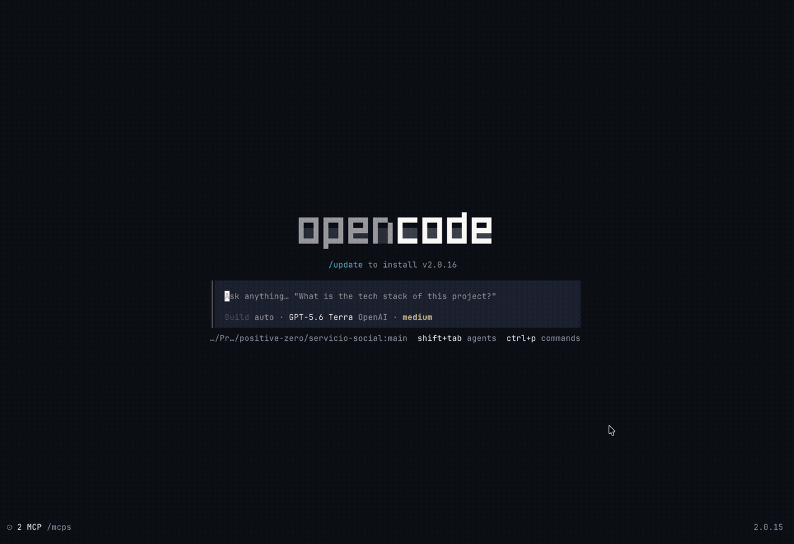

# opencode-search

A fast, local session-search plugin for [OpenCode](https://opencode.ai). Search past conversations by title, message text, tool output, and file references without leaving the terminal.



## Features

- **Full-text search** across OpenCode session transcripts, including user messages, assistant responses, tool output, and referenced files.
- **Fuzzy matching** for small typos and partial terms, with title matches ranked ahead of weaker transcript matches.
- **Project-first results** so the sessions most relevant to the current workspace stay in focus.
- **Cross-project search** when you need to find an older conversation anywhere in your local OpenCode history.
- **Context preview** with matching excerpts and a compact message timeline before opening a result.
- **Session actions** to pin, rename, or delete sessions from the picker.
- **Local SQLite index** that is created on first use and incrementally refreshed as sessions change.

## Install

Install the versioned Git package with OpenCode:

```sh
opencode plugin add github:arvindell/opencode-search#v1.0.2
```

Restart OpenCode. The installer adds the TUI plugin to your global `cli.json`.

> The plugin searches locally stored OpenCode sessions. It does not send transcript content to an external search service.

## Usage

Open the command picker in OpenCode and run:

```text
/search
```

You can also start with a query:

```text
/search payment webhook
```

Search begins in the current project by default. Press **Ctrl+A** to include sessions from every project.

### Keyboard shortcuts

| Shortcut | Action |
|---|---|
| **↑ / ↓** | Move through results |
| **Enter** | Open the selected session |
| **Ctrl+A** | Toggle current-project / all-project search |
| **Ctrl+F** | Pin or unpin a session |
| **Ctrl+R** | Rename the selected session |
| **Ctrl+D** twice | Delete the selected session |

## How search works

The first search builds a local SQLite full-text index from your session history. Later searches reuse that index and refresh only sessions that changed, so the picker stays responsive even when your history gets large.

Results combine exact full-text matches, title matches, prefix matching, and limited typo-tolerant matching. The selected result shows the relevant message excerpts alongside a compact conversation timeline, which makes it easier to recognize the right session before reopening it.

## Development

This plugin is written in TypeScript and uses Bun for local checks:

```sh
bun test
bun run typecheck
```

## License

MIT — see [LICENSE](LICENSE).
